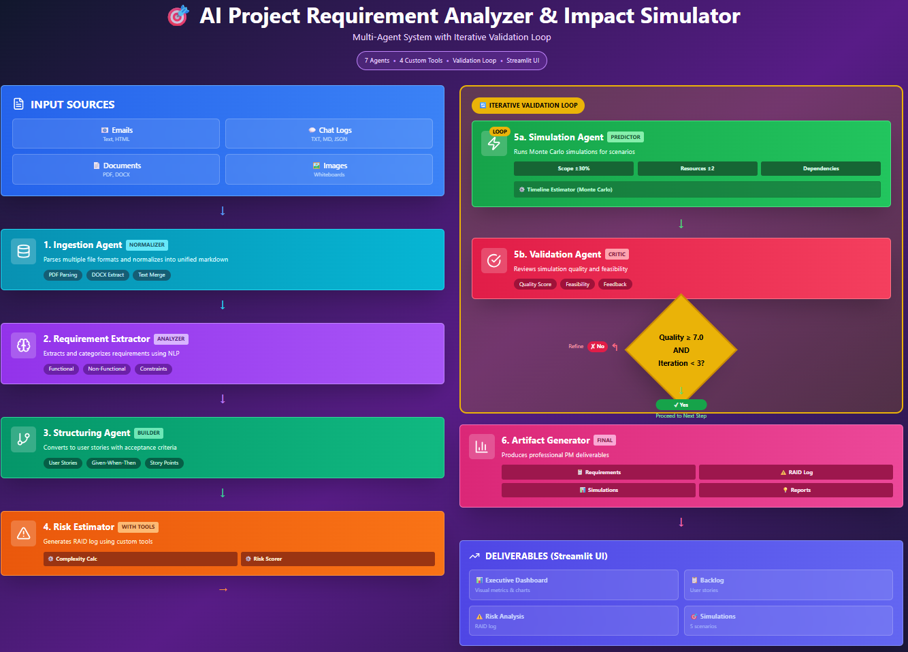

# 📘 AI Project Requirement Analyzer & Impact Simulator
#### Project Intelligence Studio • Gemini powered Multi-Agent 

---

## 📌 Overview

The AI Project Requirement Analyzer & Impact Simulator is a Streamlit application powered by Google Gemini and a custom multi-agent architecture.
It helps product managers, analysts, and engineering teams convert unstructured project briefs into structured requirements, identify risks, estimate complexity, and simulate timelines.

The system ingests raw text, PDFs, and screenshots and produces a complete executive summary with dashboards, risk mitigation recommendations, and scenario-based forecasting.

--- 
## ❗ Problem Statement

Modern software projects often begin with scattered, unstructured, and ambiguous requirements collected from meetings, emails, whiteboard photos, PDF documents, and brainstorming notes.
This creates several challenges:

#### Poor Requirement Clarity
Teams spend significant time interpreting notes, identifying functional vs. non-functional requirements, and detecting contradictions or missing details.

#### Inefficient Manual Analysis
PMs and analysts manually parse documents to extract tasks, estimate effort, and understand dependencies — a process that is slow and error-prone.

#### Risk Blind Spots
Security, performance, integration, and timeline risks remain hidden until late in the development cycle.

#### Inaccurate Timelines
Without structured requirements and clear risks, estimating timelines becomes guesswork, often leading to delays.

#### Lack of Decision Intelligence
Leaders need scenario-based forecasting (e.g., What if the team reduces? What if scope increases?) but generating these insights manually takes days.

---

## 📍 Goal of This Project

To build an intelligent, Gemini-powered multi agent system that:

Automatically extracts structured requirements

Detects risks and generates mitigation action plans

Estimates project complexity

Simulates delivery timelines with different scenarios

Produces an executive-ready summary and visual dashboard

This transforms early-stage requirement analysis from **hours of manual work** into a **few seconds of automated intelligence**.

--- 

### 🎯 Key Features
###  Multi-Agent Architecture

The system orchestrates specialized agents working together to produce deep analysis:

#### 1. Ingestion Agent — Normalizer

#### Purpose: Convert all incoming formats into clean, unified markdown.
#### Supports: Text, PDFs, DOCX, meeting notes, and images (whiteboard/screenshots).
Functions:

* Optical Character Recognition (OCR) extraction : extracting text from images or scanned documents.

* PDF parsing : analyzing a PDF file to extract its text, metadata, layout, tables, images, or other structural elements.

* Format normalization : transforming data from different formats (text, PDFs, DOCX, logs, images, HTML, JSON, etc.) into a consistent, unified structure.

* Semantic merging of multi-source inputs : combining data from multiple sources (e.g., text, PDFs, logs, emails, images, transcripts) by understanding their meaning, removing duplicates, aligning overlapping content, and producing a unified, coherent output. 

#### 2. Requirement Extractor Agent — Analyzer

* Purpose: Identify, extract, and classify requirements.
* Outputs:

   * Functional requirements

   * Non-functional requirements

   * Constraints

   * Policy or compliance items

Uses NLP, rule-based checks, and pattern detection to provide structured requirement lists.

#### 3. Structuring Agent — Builder

* Purpose: Transform extracted requirements into actionable engineering artifacts.
* Outputs:

    * User stories

    * Acceptance criteria

    * “Given–When–Then” test scenarios

    * Story point suggestions

#### Human Validation Step — Manual Approval (Optional)

Before the pipeline advances, a human reviewer can inspect extracted requirements:

✔ Approve

✔ Edit

✔ Add missing items

✔ Reject and re-run extraction

If manual approval is disabled, the pipeline proceeds automatically.

This improves trustworthiness when analyzing real client deliverables.

#### 4. Risk Estimator Agent — With Tools

* Purpose: Calculate project risk and complexity using custom tools.
* Capabilities:

    * Complexity scoring (0–10 deterministic model)

    * Probability × Impact matrix

    * RAID log generation

    * Neural risk pattern detection (e.g., offline mode, SSO, legacy systems)

#### 5. Iterative Validation Loop

#### 5a. Simulation Agent — Predictor

5a. Simulation Agent — Predictor

Runs Monte Carlo–style simulations across 
* multiple what-if scenarios, such as: 

    * Scope +20%

    * Team reduction

    * Dependency delays

    * Best/realistic/worst case timelines

    * Scope +20%

    * Team reduction

    * Dependency delays

    * Best/realistic/worst case timelines

Runs thousands of iterations to generate probabilistic timeline forecasts.

#### 5b. Validation Agent — Critic

* Purpose: Judge the quality, consistency, and feasibility of the generated outputs.
* Checks include:

    * Requirement completeness
    * Contradiction detection
    * Simulation plausibility
    * Output quality scoring

* Quality Gate Logic

    * If (Quality Score ≥ 7.0) AND (Iterations < 3):
      → Proceed to next step : Artifact Generation
    * Else:
      → Refine & Repeat Extraction/Structuring/Simulation

#### 6. Artifact Generator Agent — Finalizer

* Purpose: Produce polished deliverables for stakeholders.
* Deliverables include:

    * Executive Summary
    * Structured Requirements
    * RAID Log
    * Risk Mitigation Plan
    * Timeline Simulations
    * Recommendations
    * Dashboard-ready JSON & charts (Streamlit-powered)

--- 
# 🏗 Architecture

--- 

#### 1️⃣ Clone the Repository
    git clone https://github.com/<your-username>/AI-Project-Requirement-Analyzer-Impact-Simulator.git
    cd AI-Project-Requirement-Analyzer-Impact-Simulator

#### 2️⃣ Setup the Virtual Environment

    python -m venv .venv
    .\.venv\Scripts\activate     # Windows
    source .venv/bin/activate    # macOS/Linux

#### 3️⃣ Install Dependencies

    pip install -r requirements.txt

#### 4️⃣ Configure Your API Key
Browse https://aistudio.google.com/api-keys and generate API Key
   

    set GOOGLE_API_KEY=your_key   # Windows
    export GOOGLE_API_KEY=your_key  # macOS/Linux

#### 5️⃣ Run the Application

    streamlit run web_app.py

Access it at:
👉 http://localhost:8501