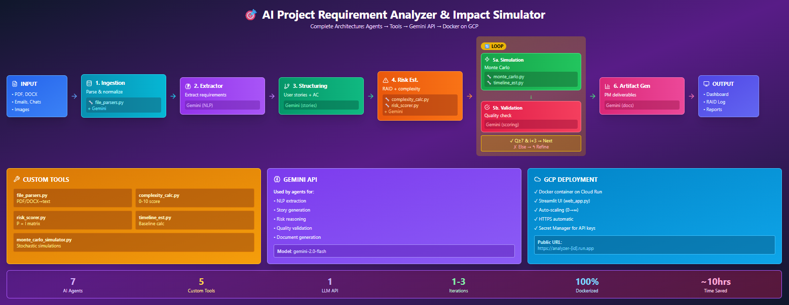
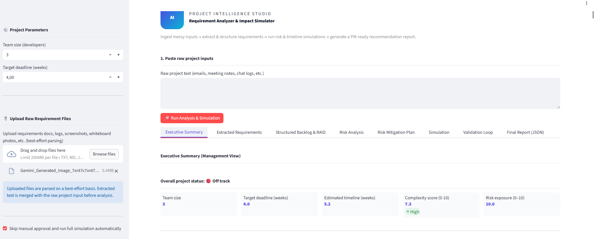
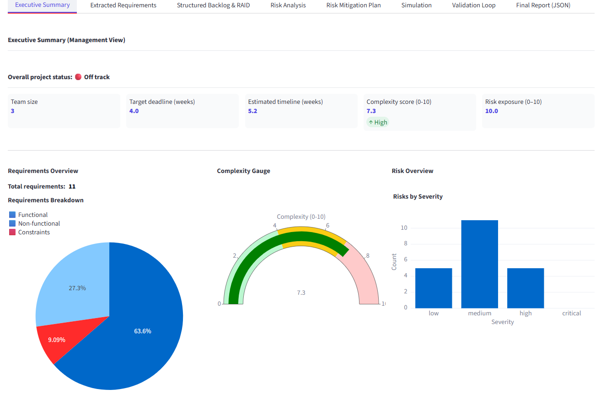
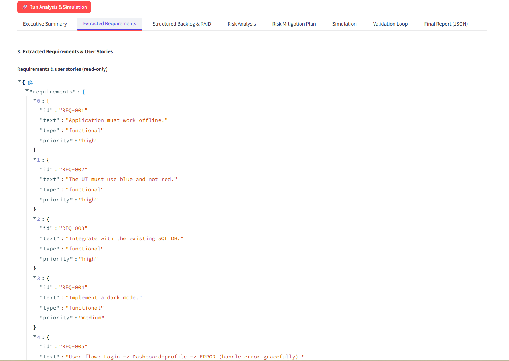
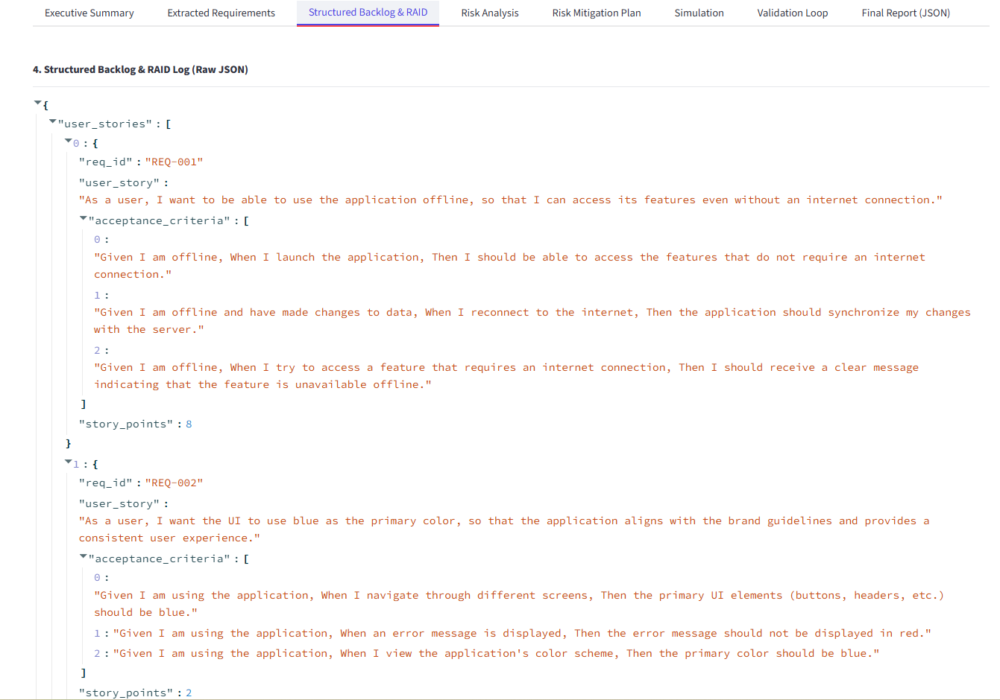
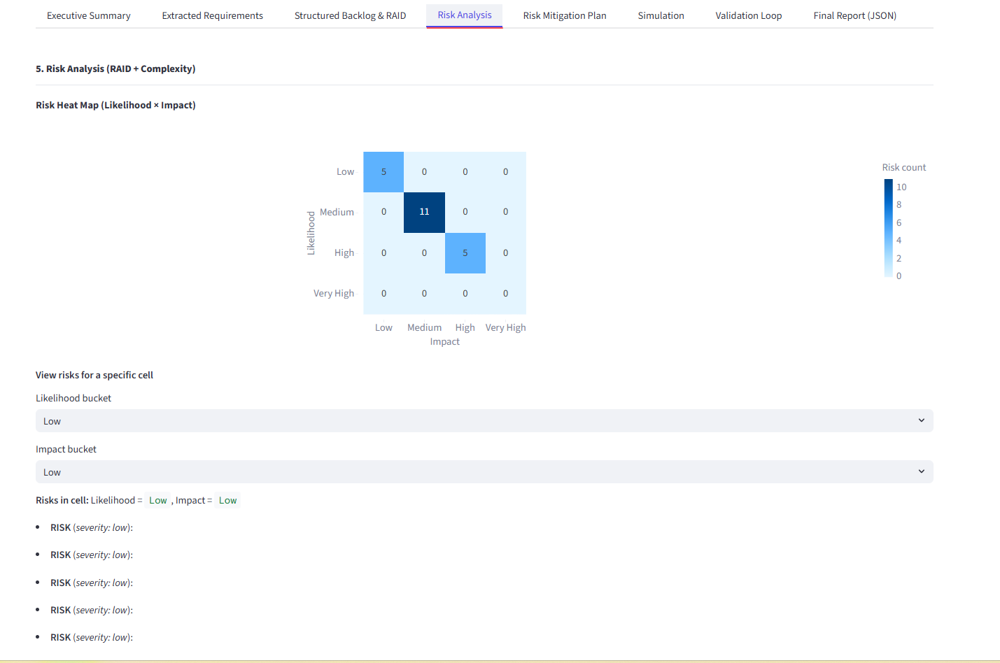
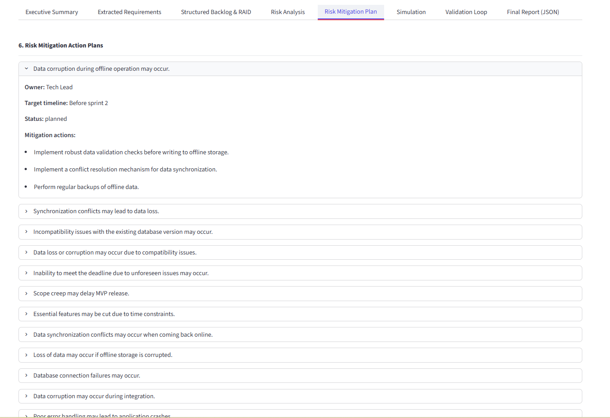
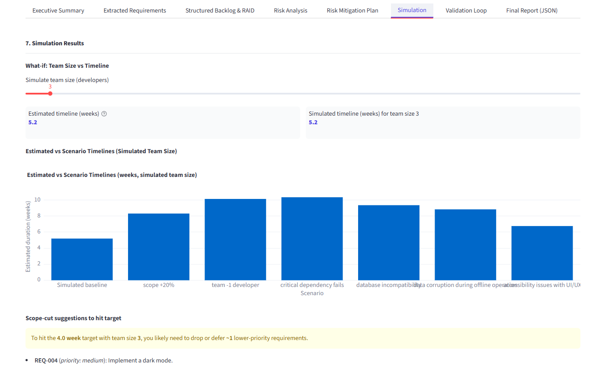
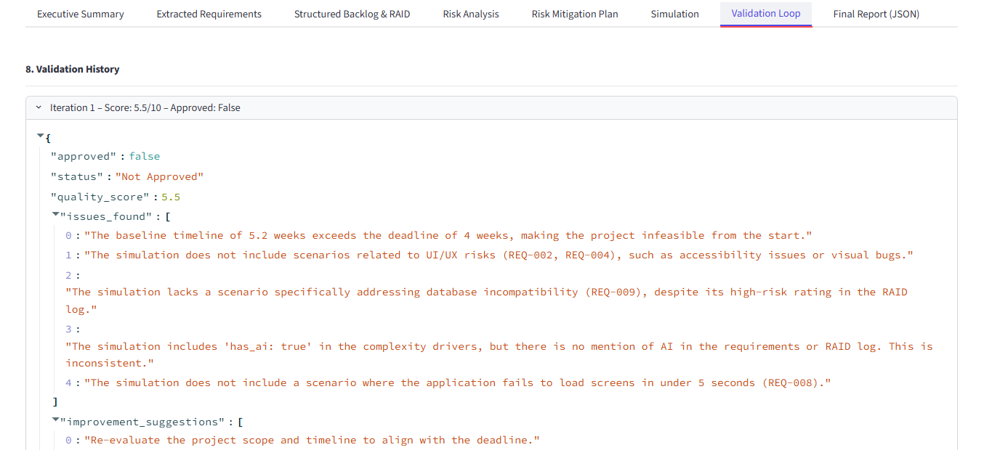
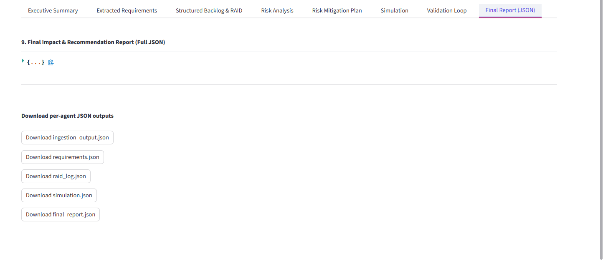

# 📘 AI Project Requirement Analyzer & Impact Simulator
#### Project Intelligence Studio • Gemini powered Multi-Agent 

---

## 📌 Overview

The AI Project Requirement Analyzer & Impact Simulator is a Streamlit application powered by Google Gemini and a custom multi-agent architecture.
It helps product managers, analysts, and engineering teams convert unstructured project briefs into structured requirements, identify risks, estimate complexity, and simulate timelines.

The system ingests raw text, PDFs, and screenshots and produces a complete executive summary with dashboards, risk mitigation recommendations, and scenario-based forecasting.

--- 
## ❗ Problem Statement

Modern software projects often begin with scattered, unstructured, and ambiguous requirements collected from meetings, emails, whiteboard photos, PDF documents, and brainstorming notes.
This creates several challenges:

#### Poor Requirement Clarity
Teams spend significant time interpreting notes, identifying functional vs. non-functional requirements, and detecting contradictions or missing details.

#### Inefficient Manual Analysis
PMs and analysts manually parse documents to extract tasks, estimate effort, and understand dependencies — a process that is slow and error-prone.

#### Risk Blind Spots
Security, performance, integration, and timeline risks remain hidden until late in the development cycle.

#### Inaccurate Timelines
Without structured requirements and clear risks, estimating timelines becomes guesswork, often leading to delays.

#### Lack of Decision Intelligence
Leaders need scenario-based forecasting (e.g., What if the team reduces? What if scope increases?) but generating these insights manually takes days.

---

## 📍 Goal of This Project

To build an intelligent, Gemini-powered multi agent system that:

Automatically extracts structured requirements

Detects risks and generates mitigation action plans

Estimates project complexity

Simulates delivery timelines with different scenarios

Produces an executive-ready summary and visual dashboard

This transforms early-stage requirement analysis from **hours of manual work** into a **few seconds of automated intelligence**.

--- 

### 🎯 Key Features

#### High-level flow

1. User opens the Streamlit dashboard (web_app.py) in the browser.

2. Streamlit sends the raw project description + any uploaded files to the orchestrator (main_agent.py).

3. main_agent.py runs a sequential multi-agent pipeline in src/agents/
with an iterative Simulation ↔ Validation loop.

4. Each agent calls Gemini via the shared client (configured in config.py) and, where needed, uses custom tools in src/tools/.

5. The final results (requirements, risks, simulations, artifacts) are rendered back into the Streamlit UI.

###  Multi-Agent Architecture

The system orchestrates specialized agents working together to produce deep analysis:

### 1. Ingestion Agent — Normalizer

#### Role
Normalize all incoming project inputs into a single clean markdown document.

#### Inputs

* Free-text project brief entered in Streamlit.

* Uploaded files (PDF, DOCX, TXT, MD, JSON, etc.).

* Simple metadata from UI (project name, team size, deadline, etc.).

#### Tools used

* tools/file_parsers.py

* PDF → text

* DOCX → text

* TXT/MD/JSON → text

#### Image handling (via Gemini Vision / image-to-text)

* PNG/JPG → extracted text (OCR) → normalized requirement snippets

Optional light LLM normalization with Gemini (e.g. cleaning headers, removing boilerplate).

#### Gemini usage

* Prompted to “summarize and normalize multiple snippets into a consistent markdown project description”.

#### Outputs

* normalized_context_md – a single markdown block that becomes the canonical input for downstream agents.

* Basic extracted metadata (if any, e.g. dates, stakeholders).

#### 2. Requirement Extractor Agent — (requirement_extractor_agent.py) 

#### Role
Extract and categorize requirements using NLP on the normalized project context.

#### Inputs

* normalized_context_md from Ingestion Agent.

* Optional UI hints (e.g. domain, priority focus).

#### Tools used

* Core tool = Gemini LLM (no local custom tools here).

#### Gemini usage

* Prompted to:

   * Extract all explicit and implicit requirements.

   * Classify into Functional / Non-Functional / Constraints.

   * Assign IDs, short titles and brief descriptions.

   * Optionally infer priority (High/Medium/Low).

Outputs

* requirements_raw – list of requirement dicts, e.g.
 
  {id, title, description, category, priority, source}.

* Basic quality tags (e.g. vague / ambiguous / conflicting) if detected.

These are shown in Streamlit under “Extracted Requirements”, where the user can edit, add or delete items before running the full simulation (if manual approval is enabled).

#### 3. Structuring Agent — Builder (structuring_agent.py)

#### Role
Convert raw requirements into structured agile artifacts.

#### Inputs

requirements_raw (possibly edited by the user in Streamlit).

#### Tools used
* Gemini LLM.

Gemini usage

* Prompted to:

    * Convert each requirement into a user story (As a … I want … so that …).

    * Add acceptance criteria in Gherkin or checklist form.

    * Optionally estimate story points or effort buckets.

#### Outputs

* structured_requirements – list of user stories with:

  {id, user_story, acceptance_criteria[], story_points, category, priority}.

These feed both the **risk analysis** and the **simulation**.

#### Human Validation Step — Manual Approval (Optional)

Before the pipeline advances, a human reviewer can inspect extracted requirements:

✔ Approve

✔ Edit

✔ Add missing items

✔ Reject and re-run extraction

If manual approval is disabled, the pipeline proceeds automatically.

This improves trustworthiness when analyzing real client deliverables.

#### 4. Risk Estimator Agent  (risk_estimator_agent.py)

#### Role
Generate a risk profile for the project and each requirement, and compute an overall complexity score.

#### Inputs

* structured_requirements

* Context metadata (team size, deadline, dependencies, etc.).
#### Tools used
**1. tools/complexity_calculator.py** 
* Heuristic aggregation of:
  * Number of requirements.
  * Distribution of functional vs non-functional vs constraints.
  * Story points / effort.
  * Dependencies & critical constraints.

**2.  tools/risk_scorer.py**
* For each requirement, derive:
  * Probability (Low/Medium/High or 1–5).
  * Impact (Low/Medium/High or 1–5).
  * Risk score (e.g. probability * impact).
* Maps to severity buckets for the bar chart.

**3. Gemini LLM**
* Used to describe risk drivers, risk categories (schedule, scope, technical, stakeholder, etc.) and mitigation suggestions.

#### Outputs

* project_complexity_score (0–10) for the gauge.

* risk_items list for the risk bar chart and RAID log, each with:

  {requirement_id, risk_title, description, probability, impact, score, severity, mitigation, owner}.

* Summary: top 3–5 key risks and overall risk posture (e.g. “Moderate risk; main drivers: integration complexity, unclear NFRs”).

#### 5. Iterative Validation Loop

#### 5a. Simulation Agent (simulation_agent.py)

#### Role
Predict timeline impact using **Monte Carlo-style scenario simulations**.
#### Inputs
* structured_requirements

* project_complexity_score

* Team size, working days/week, productivity assumptions (from config or UI).

#### Tools used

**1. tools/timeline_estimator.py**
* Deterministic base estimation:
  * Convert story points / effort into person-days.
  * Adjust for team size, buffer, and complexity.
  * Produce baseline duration.

**2.tools/monte_carlo_simulator.py**
* Run multiple simulation runs (e.g. 500–1,000) with:
  * Randomized productivity.
  * Random delay factors (risks, rework).
* Output distribution of completion dates and percentiles.

**3. Gemini LLM**
* Summarizes simulation results into human-readable insights.

#### Outputs
* scenario_results:
  * Best / Expected / Worst case durations and end dates.
  * Percentiles (P10, P50, P90) and schedule-slip vs baseline.
* Time series data for the timeline impact chart in Streamlit. 

#### 5b. Validation Agent (validation_agent.py)

#### Role
Act as a **critic** for the simulation and overall requirement quality, driving the iterative validation loop.

#### Inputs

* structured_requirements
* risk_items
* scenario_results
* Current loop iteration counter.

#### Tools used

* Gemini LLM – acts as the validator/critic.
* Internal quality heuristics (e.g. minimum number of acceptance criteria, no empty descriptions).

#### Gemini usage
* Compute:
  * Overall Requirement Quality Score (0–10).
  * Dimension scores: clarity, feasibility, testability, consistency.
  * Natural-language feedback and refinement suggestions.
#### Decision logic (loop condition)
* If quality_score >= 7.0 AND iteration < 3:
  * Validation passes → exit loop.
* Else:
  * Use Gemini’s feedback to:
    * Refine requirements.
    * Adjust risks or assumptions.
  * Re-run Simulation Agent ⇒ new scenario_results.
  * Repeat until quality threshold or max iterations reached.
#### Outputs

* quality_score
* validation_feedback
* Potentially refined structured_requirements / assumptions used in next loop iteration.

#### 6. Artifact Generator Agent (artifact_generator_agent.py)

#### Role
Produce **PM-ready deliverables** from all previous stages.

#### Inputs

* Final structured_requirements (after validation loop).
* risk_items and mitigation actions.
* scenario_results and timeline metrics.
* quality_score and feedback summary.

#### Tools used

* Gemini LLM – for document generation and professional wording.

* Optionally exports could later be wired to tools for PDF/Excel, but in repo it mainly formats for Streamlit.

#### Outputs / Deliverables (shown in Streamlit)

* **Executive Dashboard** data: KPIs, charts, recommendations.

* **Requirements backlog** (user stories + acceptance criteria).

* **RAID log** (Risks, Assumptions, Issues, Dependencies).

* **Simulation summary**: scenario comparison, schedule-slip, recommendations.

### Custom Tools Overview (src/tools/)

| Tool file                  | Purpose                                                                                 | Used by                  |
| -------------------------- | --------------------------------------------------------------------------------------- | ------------------------ |
| `file_parsers.py`          | Parse PDFs, DOCX, TXT, MD, JSON into raw text                                           | Ingestion Agent          |
| `complexity_calculator.py` | Compute 0–10 overall complexity from requirement volume, story points, constraints etc. | Risk Estimator Agent     |
| `risk_scorer.py`           | Score probability × impact, severity buckets, structure risk items                      | Risk Estimator Agent     |
| `monte_carlo_simulator.py` | Run stochastic simulations on timeline / productivity                                   | Simulation Agent         |
| `timeline_estimator.py`    | Deterministic baseline duration estimation                                              | Simulation Agent         |
| `main_agent.py`            | Orchestrator that wires all agents + tools together                                     | Called from `web_app.py` |

#### Gemini API integration

* Centralized in config.py and/or each agent file:

   * Loads GEMINI_API_KEY from .env.
   * Constructs a generativeai.Client (or similar).
   * Shared across agents to reduce setup overhead.
* Each agent defines prompt templates specific to its role

  (extraction, structuring, risk analysis, simulation explanation, validation, artifact generation).

##### 4. Deployment Architecture on GCP (Docker + Streamlit)
**Runtime architecture**

1. User opens the public HTTPS URL.
2. Request hits Cloud Run (or another container runtime) that runs your Docker image.
3. The container starts Streamlit (web_app.py) on internal port (e.g. 8501).
4. Streamlit calls main_agent.run_full_pipeline() inside the container.
5. Agents call Gemini API over the internet using the API key stored as a GCP secret / env var.
6. Responses are rendered back to the user as the interactive dashboard.

### Prerequisites

### Prerequisites

- A Google Cloud project (repo used: `ai-project-req-analyzer`)
- **Docker** installed locally
- **gcloud** CLI installed and authenticated

bash command :

gcloud auth login
gcloud config set project ai-project-req-analyzer
--- 

#### 1. Build the Docker image

From the project root (where Dockerfile and web_app.py live):

 `docker build -t req-analyzer:latest .`

The Dockerfile starts from python:3.11-slim, installs requirements.txt, copies the app, and runs:

` streamlit run web_app.py --server.port=8080 --server.address=0.0.0.0`

#### 2. Test the container locally

`docker run -p 8080:8080 req-analyzer:latest`

Open: http://localhost:8080 and verify the app works, then stop the container.

#### 3. Push image to Google Artifact Registry

This project uses:

* Region: europe-west3

* Artifact Registry repo: req-analyzer-repo

* Image name: req-analyzer

If the repository does not exist yet, create it:

`gcloud services enable artifactregistry.googleapis.com`

`gcloud artifacts repositories create req-analyzer-repo \
  --repository-format=docker \
  --location=europe-west3 \
  --description="Docker images for AI Project Requirement Analyzer`

Authenticate Docker to Artifact Registry:

`gcloud auth configure-docker europe-west3-docker.pkg.dev`

Tag and push the image (example tag: v2):

`docker tag req-analyzer:latest \
  europe-west3-docker.pkg.dev/ai-project-req-analyzer/req-analyzer-repo/req-analyzer:v2`

`docker push europe-west3-docker.pkg.dev/ai-project-req-analyzer/req-analyzer-repo/req-analyzer:v2`

#### 4. Deploy to Cloud Run

Enable Cloud Run:

`gcloud services enable run.googleapis.com`

🔐 Environment variables
The app expects a Gemini / Google Generative AI API key in GOOGLE_API_KEY.

Deploy a Cloud Run service named req-analyzer:

`gcloud run deploy req-analyzer \
  --image europe-west3-docker.pkg.dev/ai-project-req-analyzer/req-analyzer-repo/req-analyzer:v2 \
  --region europe-west3 \
  --platform managed \
  --allow-unauthenticated \
  --port 8080 \
  --memory 2Gi \
  --cpu 2 \
  --max-instances 5 \
  --set-env-vars GOOGLE_API_KEY=YOUR_GOOGLE_API_KEY_HERE`

After deployment, gcloud prints a URL of the form:

https://req-analyzer-xxxxxxxxxx-europe-west3.run.app

This is the public endpoint for the Requirement Analyzer & Impact Simulator Streamlit app.

**Visually the project works like below ** :

Browser → HTTPS → GCP Cloud Run (Docker container) → Streamlit app → main_agent → agents + tools → Gemini API

Below is the link where the agent was deployed through docker to GCP

https://ai-project-requirement-analyzer-588957641146.europe-west3.run.app/ 

(https service was diasbled to save money)

#### 5. Updating the deployment

To deploy a new version:

#### 1. Rebuild the image:

`docker build -t req-analyzer:latest .`

2. Tag with a new version (e.g. v3) and push:

`docker tag req-analyzer:latest \
  europe-west3-docker.pkg.dev/ai-project-req-analyzer/req-analyzer-repo/req-analyzer:v3`

`docker push europe-west3-docker.pkg.dev/ai-project-req-analyzer/req-analyzer-repo/req-analyzer:v3`

3. Deploy the new tag:

`gcloud run deploy req-analyzer \
  --image europe-west3-docker.pkg.dev/ai-project-req-analyzer/req-analyzer-repo/req-analyzer:v3 \
  --region europe-west3 \
  --platform managed \
  --allow-unauthenticated \
  --port 8080 \
  --memory 2Gi \
  --cpu 2 \
  --max-instances 5 \
  --set-env-vars GOOGLE_API_KEY=YOUR_GOOGLE_API_KEY_HERE`

# 🏗 Architecture

--- 
## To run locally the project follow below steps

#### 1️⃣ Clone the Repository
    git clone https://github.com/<your-username>/AI-Project-Requirement-Analyzer-Impact-Simulator.git
    cd AI-Project-Requirement-Analyzer-Impact-Simulator

#### 2️⃣ Setup the Virtual Environment

    python -m venv .venv
    .\.venv\Scripts\activate     # Windows
    source .venv/bin/activate    # macOS/Linux

#### 3️⃣ Install Dependencies

    pip install -r requirements.txt

#### 4️⃣ Configure Your API Key
Browse https://aistudio.google.com/api-keys and generate API Key
   

    set GOOGLE_API_KEY=your_key   # Windows
    export GOOGLE_API_KEY=your_key  # macOS/Linux

#### 5️⃣ Run the Application

    streamlit run web_app.py

Access it at:
👉 http://localhost:8501

# Multi-Agent Sample Inputs and outputs ( demo )
### Raw Project Requirement Input : Format png

### Agent outputs :

**Landing page** : Upload raw inputs (PDFs, docs, images, chat logs) and define project parameters before running the pipeline.

**Executive Summary** : A high-level, PM-ready overview of project goals, complexity, risks, and simulated delivery timelines.

**Extracted Requirements** : Automatically generated list of all functional, non-functional, and constraint requirements extracted from the raw project inputs. 

**Structured Backlog** : A complete backlog of user stories with acceptance criteria and priority, generated from extracted requirements.

**Risk Analysis** : Detailed risk identification showing probability, impact, severity, and risk distribution across the project.

**Risk Mitigation Plans** : Actionable mitigation strategies for high-severity risks, including owners, actions, and recommended timelines.

**Simulation** : Timeline simulations (best/expected/worst cases) generated using complexity, team size, and risk-adjusted factors.

**Validation** : Quality scoring and refinement feedback from the validation agent, ensuring clarity, feasibility, and consistency.

**Final Report for PM** : A consolidated, executive-friendly report summarizing requirements, risks, simulations, and key recommendations.

**Final Downloadable Report (JSON Format)** : Machine-readable JSON export containing the complete structured output from all agents.
[Final Report (JSON Format)](Sample_outputs/final_report.json)